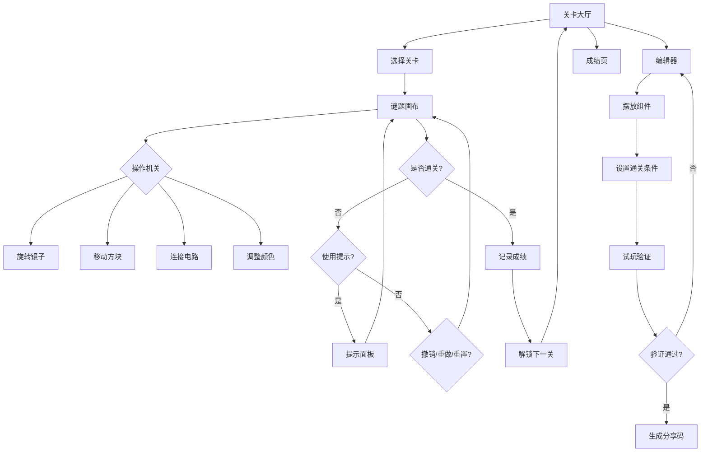

## 1. 产品概述

机关谜题（MechPuzzle）是一款纯前端益智解谜网页应用，玩家在浏览器中通过旋转镜子、移动方块、连接电路、调整颜色顺序来打开出口通关。支持撤销/重做/重置/计步，逐步解锁新机关，使用有限提示，查看最少步数目标，收藏难题，分享关卡链接，并通过编辑器自创关卡。成绩页展示通关时间、步数评级和连续解谜天数。

- 目标用户：喜欢逻辑推理与空间思维的益智游戏爱好者
- 核心价值：零安装、即开即玩、丰富机关类型、支持创作与分享

## 2. 核心功能

### 2.1 用户角色

| 角色 | 注册方式 | 核心权限 |
|------|----------|----------|
| 玩家 | 无需注册，本地存储 | 浏览关卡、解谜、使用提示、收藏、查看成绩 |
| 创作者 | 无需注册 | 使用编辑器创建关卡、试玩验证、生成分享码 |

### 2.2 功能模块

1. **关卡大厅**：关卡网格展示、锁定/解锁状态、收藏标记、最少步数目标、关卡分类筛选
2. **谜题画布**：网格化交互画布，支持四种机关类型操作，撤销/重做/重置/计步控制栏
3. **提示面板**：有限次数提示、渐进式提示（从模糊到具体）、提示剩余次数
4. **编辑器**：组件选择面板、网格画布摆放、通关条件设置、试玩验证、分享码生成/导入
5. **成绩页**：通关时间统计、步数评级（S/A/B/C）、连续解谜天数、历史记录

### 2.3 页面详情

| 页面名称 | 模块名称 | 功能描述 |
|----------|----------|----------|
| 关卡大厅 | 关卡网格 | 展示所有关卡缩略图，显示锁定/解锁/已通关状态 |
| 关卡大厅 | 筛选栏 | 按机关类型、难度、收藏状态筛选 |
| 关卡大厅 | 关卡卡片 | 显示关卡名、最少步数、通关状态、收藏按钮 |
| 谜题画布 | 游戏网格 | 8×8 网格画布，可交互放置的机关组件 |
| 谜题画布 | 控制栏 | 撤销、重做、重置按钮和步数计数器 |
| 谜题画布 | 状态栏 | 当前关卡名、提示按钮、出口状态指示 |
| 提示面板 | 提示内容 | 渐进式展示提示文本，每次消耗1次提示机会 |
| 提示面板 | 提示计数 | 显示剩余提示次数和总提示次数 |
| 编辑器 | 组件面板 | 可拖拽的机关组件列表（镜子、方块、电路、颜色门等） |
| 编辑器 | 编辑画布 | 网格画布，支持点击放置/删除组件、设置属性 |
| 编辑器 | 属性面板 | 选中组件的属性编辑（方向、颜色、连接目标等） |
| 编辑器 | 验证栏 | 设置通关条件、试玩按钮、分享码生成/导入 |
| 成绩页 | 总览卡片 | 总通关数、平均步数评级、连续解谜天数 |
| 成绩页 | 关卡成绩列表 | 每关最佳时间、最少步数、评级、完成日期 |
| 成绩页 | 统计图表 | 解谜趋势、机关类型偏好分布 |

## 3. 核心流程

玩家从关卡大厅选择关卡进入谜题画布，在画布上操作机关组件（旋转镜子反射光束、移动方块到目标位置、连接电路形成通路、调整颜色顺序匹配目标），达成通关条件后出口打开并记录成绩。玩家可随时使用有限次数提示、撤销/重做操作、重置关卡。通关后返回大厅解锁下一关，也可进入成绩页查看详细统计。创作者可在编辑器中设计自定义关卡，试玩验证后生成分享码供他人挑战。

## 4. 用户界面设计

### 4.1 设计风格

- **风格方向**：工业机械美学 + 蒸汽朋克元素，深色主题搭配铜金色点缀
- **主色调**：深灰 #1a1a2e 为底色，铜金 #c9a96e 为强调色，铁灰 #4a4a5a 为辅助色
- **次色调**：翠绿 #2ecc71（成功/电路）、琥珀 #e67e22（警告/镜子）、宝石蓝 #3498db（信息/颜色门）
- **按钮风格**：圆角金属质感按钮，hover 时发光边缘效果
- **字体**：标题使用 Orbitron（科技感），正文使用 Noto Sans SC（中文可读性）
- **布局风格**：左侧导航栏 + 主内容区，网格化关卡布局
- **图标风格**：线性图标（Lucide），配合机械感装饰线条

### 4.2 页面设计概览

| 页面名称 | 模块名称 | UI 元素 |
|----------|----------|---------|
| 关卡大厅 | 关卡网格 | 网格卡片布局，每卡片含关卡缩略图、状态徽章、收藏星标、步数标签 |
| 关卡大厅 | 筛选栏 | 水平标签切换（全部/镜子/方块/电路/颜色），收藏筛选开关 |
| 谜题画布 | 游戏网格 | 8×8 深色网格，组件带发光效果，出口门带开关动画 |
| 谜题画布 | 控制栏 | 底部浮动工具栏，圆形金属按钮（撤销/重做/重置），步数计数器 |
| 提示面板 | 侧边抽屉 | 右侧滑出面板，提示文本逐行显示，顶部提示次数指示器 |
| 编辑器 | 编辑区 | 三栏布局：左组件面板、中画布、右属性面板，底部验证操作栏 |
| 成绩页 | 总览区 | 顶部三列统计卡片（发光边框），下方关卡成绩表格和迷你图表 |

### 4.3 响应式设计

- 桌面优先设计，主目标分辨率 1920×1080
- 平板适配：编辑器三栏改为标签页切换
- 移动端适配：关卡网格改为单列，画布支持触摸拖拽和双指缩放

### 4.4 动效设计

- 关卡解锁：锁头破碎粒子效果
- 通关：出口门打开光束动画 + 成绩卡片飞入
- 镜子旋转：3D 翻转动画
- 电路连接：电脉冲流动动画
- 按钮交互：金属按压回弹 + 边缘发光
