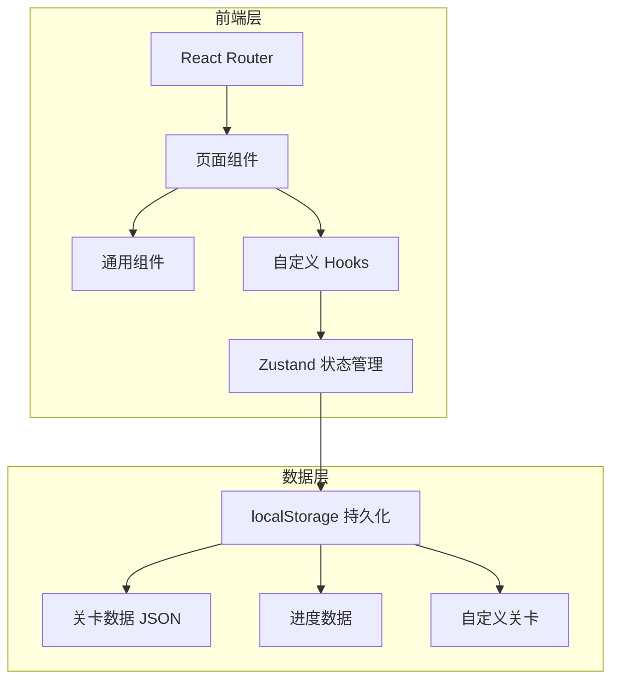
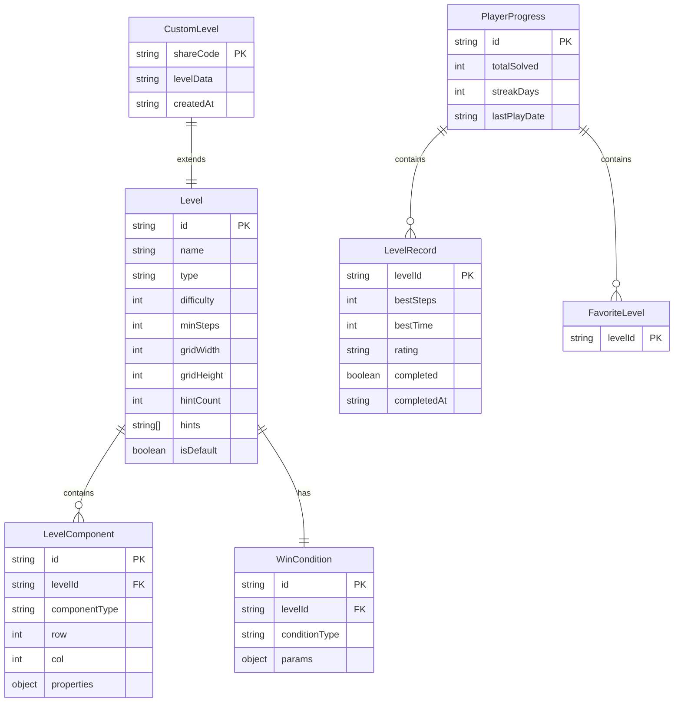

## 1. 架构设计

## 2. 技术说明

- **前端框架**：React 18 + TypeScript + Vite
- **样式方案**：Tailwind CSS 3
- **状态管理**：Zustand（含持久化中间件）
- **路由**：react-router-dom v6
- **图标库**：lucide-react
- **动画**：CSS Animations + Framer Motion
- **数据持久化**：localStorage（无后端依赖）
- **初始化工具**：vite-init（react-ts 模板）

## 3. 路由定义

| 路由 | 用途 |
|------|------|
| `/` | 关卡大厅，展示所有关卡网格 |
| `/play/:id` | 谜题画布，游玩指定关卡 |
| `/play/custom/:code` | 游玩自定义分享码关卡 |
| `/editor` | 关卡编辑器 |
| `/editor/:code` | 编辑器导入分享码 |
| `/achievements` | 成绩页 |

## 4. 数据模型

### 4.1 数据模型定义

### 4.2 数据定义

**关卡组件类型枚举**：

| 组件类型 | 说明 | 可操作属性 |
|----------|------|-----------|
| `mirror` | 镜子，旋转反射光束 | direction: 0/45/90/135 |
| `block` | 方块，可推动移动 | position: {row, col} |
| `circuit` | 电路节点，可连接 | connections: [top, right, bottom, left] |
| `color_gate` | 颜色门，调整顺序 | colorOrder: [1,2,3,4] |
| `light_source` | 光源，发出光束 | direction: 0/90/180/270 |
| `target` | 目标位置 | position: {row, col} |
| `wall` | 墙壁，不可移动 | position: {row, col} |
| `exit` | 出口门 | position: {row, col}, isOpen: boolean |

**通关条件类型**：

| 条件类型 | 说明 | 参数 |
|----------|------|------|
| `light_reach` | 光束到达指定位置 | targetPos: {row, col} |
| `block_on_target` | 方块到达目标位置 | blockId, targetId |
| `circuit_complete` | 电路形成完整回路 | nodeIds: string[] |
| `color_match` | 颜色顺序匹配目标 | targetOrder: number[] |

**步数评级标准**：

| 评级 | 条件 |
|------|------|
| S | 步数 ≤ 最少步数 |
| A | 步数 ≤ 最少步数 × 1.3 |
| B | 步数 ≤ 最少步数 × 1.7 |
| C | 步数 > 最少步数 × 1.7 |

## 5. 状态管理架构

### 5.1 Store 划分

| Store | 职责 | 持久化 |
|-------|------|--------|
| `useLevelStore` | 关卡数据、解锁状态 | 是 |
| `useGameStore` | 当前游戏状态、操作历史、撤销/重做 | 否 |
| `useProgressStore` | 通关记录、成绩、收藏、连续天数 | 是 |
| `useEditorStore` | 编辑器状态、组件选择、属性编辑 | 否 |
| `useHintStore` | 提示使用记录、剩余次数 | 是 |

### 5.2 撤销/重做机制

采用命令模式（Command Pattern）：
- 每次操作生成一个 Command 对象（含 execute 和 undo 方法）
- 操作历史栈存储 Command 序列
- 撤销：弹出最近 Command 并执行 undo
- 重做：从重做栈弹出 Command 并执行 execute
- 新操作清空重做栈

## 6. 分享码机制

- 自定义关卡数据序列化为 JSON
- 使用 LZString 压缩 JSON 字符串
- Base64 URL-safe 编码生成分享码
- 分享链接格式：`{host}/play/custom/{shareCode}`
- 编辑器导入分享码：解码并还原关卡数据
